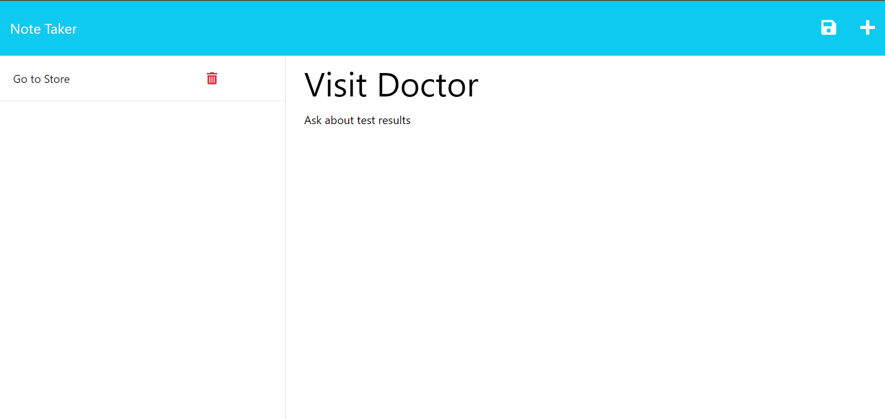

# Challenge 11 - Express.JS Note Taker

## Description

This application provides users a place to save notes for later viewing. The use of Express allows for these notes to be saved to a persistenant database which can be accessed anywhere with the use of the application's link. This means the user can have these handy notes ready to use when needed such as work or running errands.

## Table of Contents
* [Description](#description)
* [Installation](#installation)
* [Usage](#usage)
* [Contributions](#contributions)
* [Test](#test)
* [License](#license)
* [Questions and Contacts](#questions-and-contacts)

## Installation

There's no installation needed, just visit the link .

## Usage

By visiting the provided link, this application can be used by clicking the "Get Started" button in the middle of the page. This will direct the user to the notes page. Here, the user can input a Note Title and Note Text in the labeled text fields. With information in these field, a save icon will appear in the upper right corner. Clicking this will cause the valued that have been entered into the aforementioned text fields to be saved with the Note Title appearing in a list on the left side of the screen. The user can creat multiple notes as needed. Saved notes can be clicked to view again in the main text field area on the right side of the screen. Notes can also be deleted by clicking the trash icon next to its title.

## Contributions
Starting code provided by the Full Stack Bootcamp.

Structure of the `app.post` modeled after activity 13-Ins_Data-Persistence in the EXPRESS module of the Full Stack Bootcamp gitlab.

The NPM of [uuid](https://www.npmjs.com/package/uuid?activeTab=readme) used for the creation of the random ID value used in the note objects.

## Test
n/a

## License
MIT

## Questions and Contacts
Visit other repositories created by me at [github.com/hello-andyjoe](https://github.com/hello-andyjoe)

If you have questions, please email me at [andrew.joseph.roper@gmail.com](mailto:andrew.joseph.roper@gmail.com)